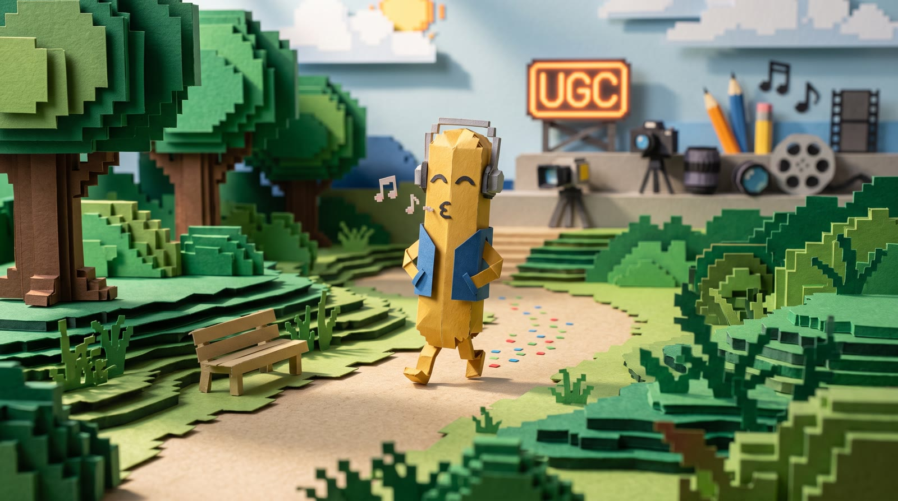

<p align="center">
  
</p>

# Breadstick

**An AI-influencer script & content factory you run yourself.** Pick a character, mix
ingredients (pain points, hooks, monetization angles, script types), and generate
production-ready scripts and video prompts for an AI video pipeline — across a classic
form-based view and a node-based visual canvas.

Breadstick is **BYOK (bring your own keys)**: you paste your own API keys (in the UI or a
local `.env`), and nothing leaves your machine except the calls you make to the providers
you configure. No telemetry, no accounts, no middleman.

> This repository is a **GitHub template**. Click **“Use this template”** to get your own
> independent copy with a clean history, then make it yours.

## Join the community

Breadstick is built in public. The free Skool community is where the recipes,
build-alongs, and **Node of the Week** live — and where you show off what you
built with yours:

**→ [Breadstick.ai on Skool](https://www.skool.com/breadstickai-4481)** — free to join.

Clone it, break it, rebuild it, and come tell us what happened.

## Quick start

You need **Node 22+** and **npm**. If port 3001 is taken, set BREADSTICK_PORT to move the proxy.

```bash
# 1. Install dependencies
npm install

# 2. Configure keys (optional — you can also paste them in the UI)
cp .env.example .env        # then edit .env

# 3. Run BOTH of these in parallel (two terminals):
npm run dev                 # Vite dev server  → http://localhost:5173
npm run server              # Express API proxy → http://localhost:3001  (required for generation)
```

Then open the dev URL. The Express proxy on port 3001 is what forwards your requests to
Anthropic / kie.ai / etc., so keep it running.

Optional:

```bash
npm run remotion:studio     # Remotion compositions (port 3333)
npm run build               # production build
npm run lint                # lint
npm run test                # unit tests (vitest)
npm run manifest            # regenerate breadstick-manifest.json after adding routes/nodes/recipes
```

## Keys

At minimum set `ANTHROPIC_API_KEY` (script generation) and `KIE_API_KEY` (image/video via
kie.ai). Everything else in `.env.example` is optional — voice (ElevenLabs), social
scheduling (Postiz/Blotato), Google Drive delivery, etc. Keys can also be entered in the
in-browser settings and are stored in your browser's localStorage. The server reads keys
from the request body first, then falls back to `.env`.

`.env` and `.secrets/` are gitignored — **never commit real keys.**

## What's inside

**Two views:**
- **Classic View** — character roster + ingredient selectors + script output. Linear:
  select character → pick ingredients → generate → copy production prompts.
- **Canvas View** — a node-based visual pipeline (`@xyflow/react`). Wire characters →
  ingredients → generators → renderers and run lanes end-to-end.

**Four content pipelines:**
1. **UGC Lane** — Character → Ingredients → Script Gen → Clip Splitter → Avatar Frames + UGC video.
2. **Carousel Video Lane** — Script → Title Card + 16-GAMI art → Frame Sandwich → Carousel + Remotion compositor.
3. **16-Gami Lane** — Script → 16-GAMI art → Carousel.
4. **Video Lane** — Script → 16-GAMI art → Video Prompt → kie.ai image-to-video.

**Demo characters:** the repo ships two example UGC personas — **Mia Chen** (`@mia.ugc`,
beauty/skincare) and **Jake Rivera** (`@jake.ugc`, supplements) — purely as format
references. Replace them with your own roster via the **“+ Add Character”** form (no code
changes needed) or by editing `src/data/characters.js`.

**MCP:** `mcp/server.js` is a stdio MCP server (auto-registered via `.mcp.json`) exposing
capability/listing/script-generation tools. See `CLAUDE.md` / `AGENTS.md` for the full
architecture notes.

## Staying up to date

This repo was created from a **template**, so it has its own independent history and does
**not** auto-sync with the upstream Breadstick repo. To pull in later harness improvements,
add the upstream once and merge when you want updates:

```bash
# one-time: point at the repo you used the template from
git remote add upstream <upstream-repo-url>

# whenever you want the latest harness changes:
git fetch upstream
git merge upstream/main        # resolve any conflicts with your customizations
```

Prefer a gentler cadence? Watch the upstream repo's **Releases** and diff a tagged version
against yours, cherry-picking only what you want. Your characters, recipes, and `.env` stay
yours either way — keep your edits in clearly-owned files to make merges painless.

## License

[MIT](LICENSE) — build, share, and monetize what you make. Have fun.
